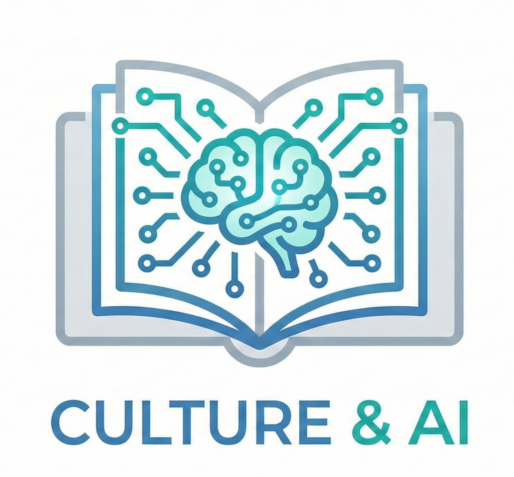
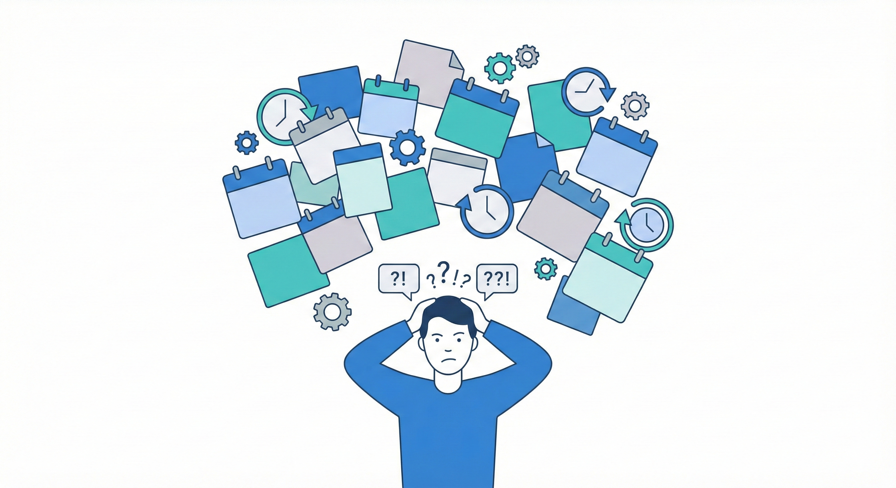
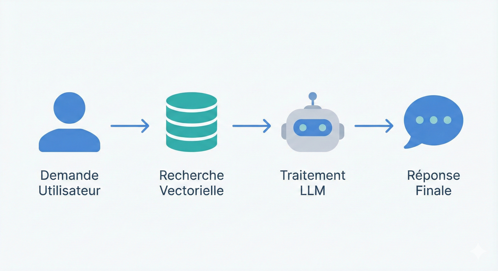
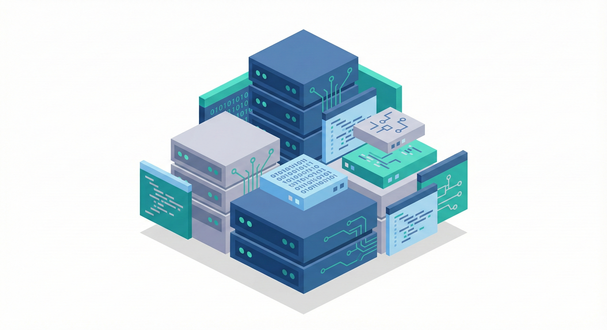
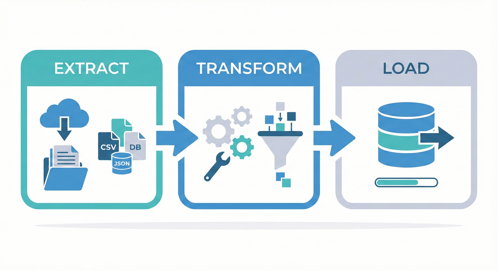
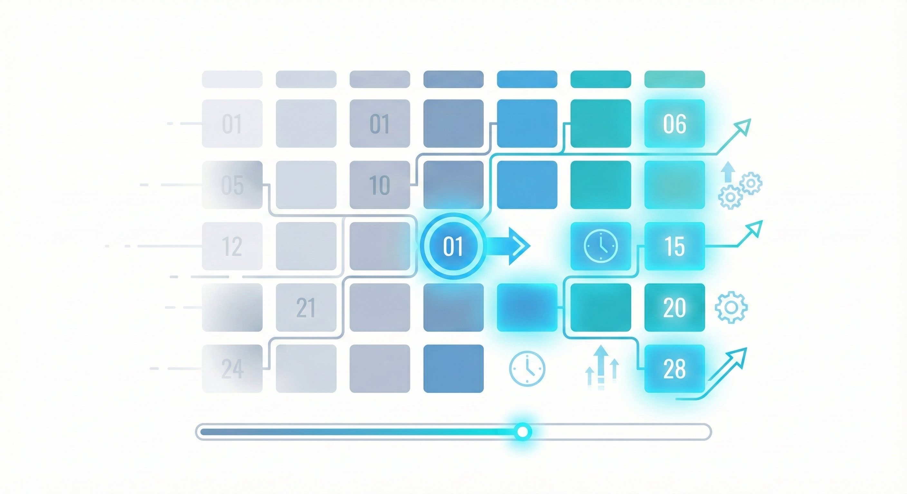
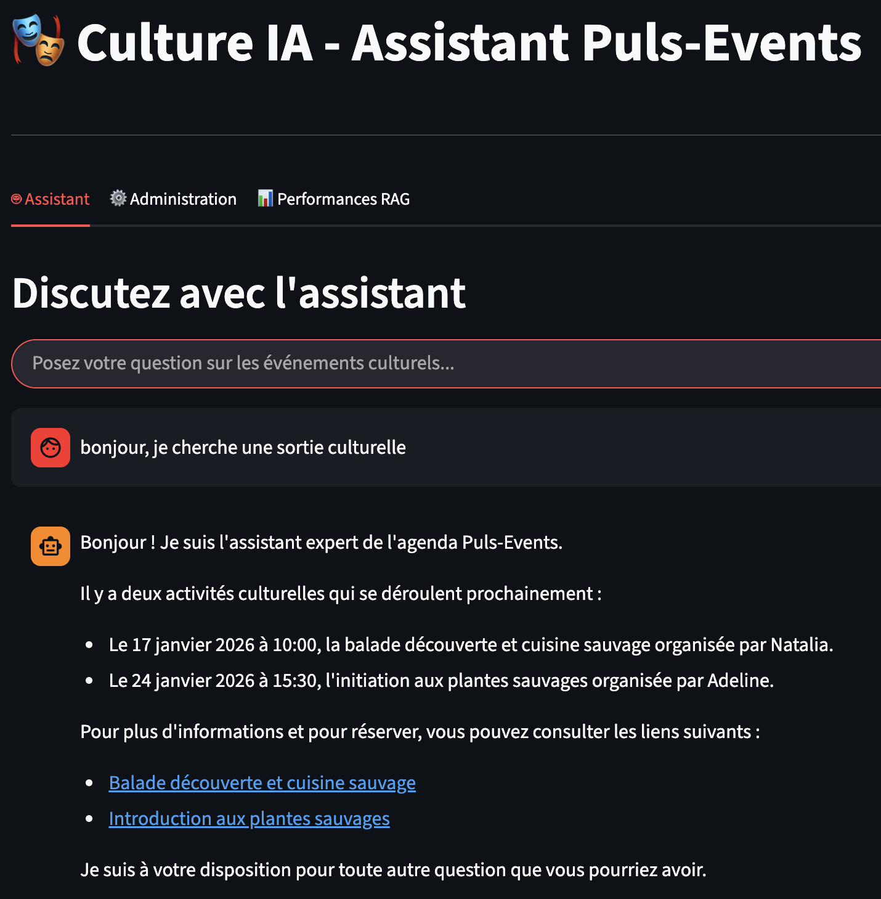
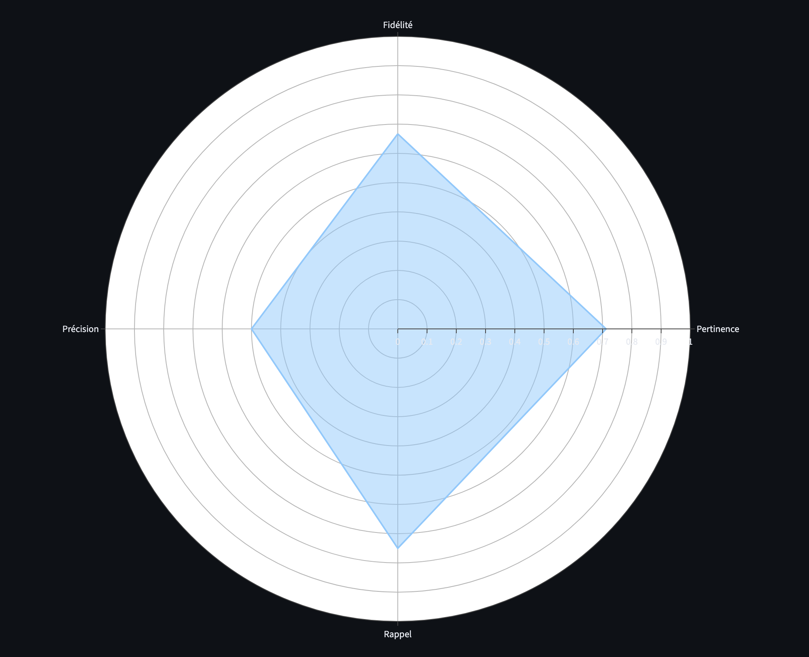
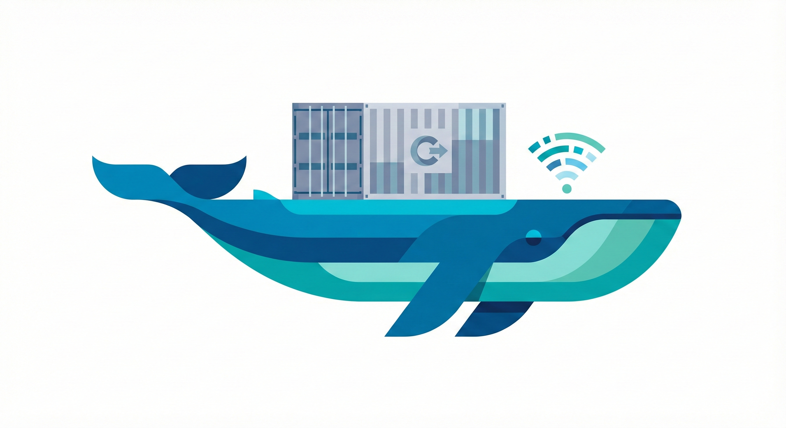

<!-- _class: lead -->

# Assistant Culture IA
## Projet 7 - Puls-Events

**Damien Guesdon**
Janvier 2026

---

# 1. Le Problème

Une base de données riche, mais une expérience utilisateur pauvre.

---

# 2. La Solution

Le RAG : Connecter l'intelligence du LLM à nos données réelles.

---

# 3. La Stack Technique

Souveraineté, Performance et Simplicité.

---

# 4. Le Pipeline de Données (ETL)

"Garbage In, Garbage Out" : La qualité avant tout.

---

# 5. Défi Technique : Le Temps

Un événement passé n'a aucune valeur.

---

<!-- _class: lead -->

# DÉMONSTRATION

  

---

# 7. Évaluation (Ragas)

  

    
On ne devine pas la qualité, on la mesure.

  

  

    
  

---

# 8. Industrialisation

Docker : "Build once, run anywhere".

---

# 9. Limites & Perspectives

Roadmap vers la V2.

---

<!-- _class: lead -->

# CONCLUSION
POC Validé. Prêt pour la production.

**Merci de votre écoute.**